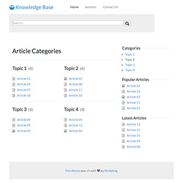

# Knowledge Base Theme

This is a basic theme for a knowledge base for [Grav CMS](http://getgrav.org).

## Installation

Installing the Knowledge Base theme can be done in one of two ways. The GPM (Grav Package Manager) installation method enables you to quickly and easily install the theme with a simple terminal command, while the manual method enables you to do so via a zip file. 

The theme by itself is useful, but you may have an easier time getting up and running by installing the skeleton. The Knowledge Base skeleton can be found `HERE`, which is a complete site with the theme itself, required plugins and configuration, and sample content.

### GPM Installation (Preferred)

The simplest way to install this theme is via the [Grav Package Manager (GPM)](http://learn.getgrav.org/advanced/grav-gpm) through your system's Terminal (also called the command line).  From the root of your Grav install type:

    bin/gpm install knowledge-base

This will install the Knowledge Base theme into your `/user/themes` directory within Grav. Its files can be found under `/your/site/grav/user/themes/knowledge-base`.

### Manual Installation

To install this theme, just download the zip version of this repository and unzip it under `/your/site/grav/user/themes`. Then, rename the folder to `knowledge-base`. You can find these files either on [GitHub](https://github.com/getgrav/grav-theme-knowledge-base) or via [GetGrav.org](http://getgrav.org/downloads/themes).

You should now have all the theme files under

    /your/site/grav/user/themes/knowledge-base

>> NOTE: This theme is a modular component for Grav which requires the [CMS itself](http://github.com/getgrav/grav) and the following plugins to properly function as written (you can of course modify the theme once installed):

  * [Error](https://github.com/getgrav/grav-theme-error) 
  * [Problems](https://github.com/getgrav/grav-plugin-problems)
  * [Count Views](https://github.com/Perlkonig/grav-plugin-count-views)
  * [Reading Time](https://github.com/getgrav/grav-plugin-readingtime)
  * [reCAPTCHA Contact](https://github.com/aradianoff/recaptchacontact)
  * [Related Pages](https://github.com/getgrav/grav-plugin-relatedpages)
  * [Simple Search](https://github.com/getgrav/grav-plugin-simplesearch)

## Updating

As development for the Knowledge Base theme continues, new versions may become available that add additional features and functionality, improve compatibility with newer Grav releases, and generally provide a better user experience. Updating Knowledge Base is easy, and can be done through Grav's GPM system or manually.

### GPM Update (Preferred)

The simplest way to update this theme is via the [Grav Package Manager (GPM)](http://learn.getgrav.org/advanced/grav-gpm). You can do this with this by navigating to the root directory of your Grav install using your system's terminal (also called command line) and typing the following:

    bin/gpm update knowledge-base

This command will check your Grav install to see if your Knowledge Base theme is due for an update. If a newer release is found, you will be asked whether or not you wish to update. To continue, type `y` and hit enter. The theme will automatically update and clear Grav's cache.

### Manual Update

Manually updating Knowledge Base is pretty simple. Here is what you will need to do to get this done:

* Delete the `your/site/user/themes/knowledge-base` directory.
* Download the new version of the Knowledge Base theme from either [GitHub](https://github.com/getgrav/grav-plugin-knowledge-base) or [GetGrav.org](http://getgrav.org/downloads/themes#extras).
* Unzip the zip file in `your/site/user/themes` and rename the resulting folder to `knowledge-base`.
* Clear the Grav cache. The simplest way to do this is by going to the root Grav directory in terminal and typing `bin/grav clear-cache`.

> Note: Any changes you have made to any of the files listed under this directory will also be removed and replaced by the new set. Any files located elsewhere (for example a YAML settings file placed in `user/config/themes`) will remain intact.

## Customizing

## Configuration

## Usage

## Credits

This is my first theme. Feedback and pull requests are warmly welcomed.

I decided to try this after a forum post asking if such a template already existed. The poster linked to [a theme called "knowhow" by Hero Themes](http://demo.herothemes.com/#knowhow). That theme inspired this one, but this one was coded completely from scratch with no reference to the original.

