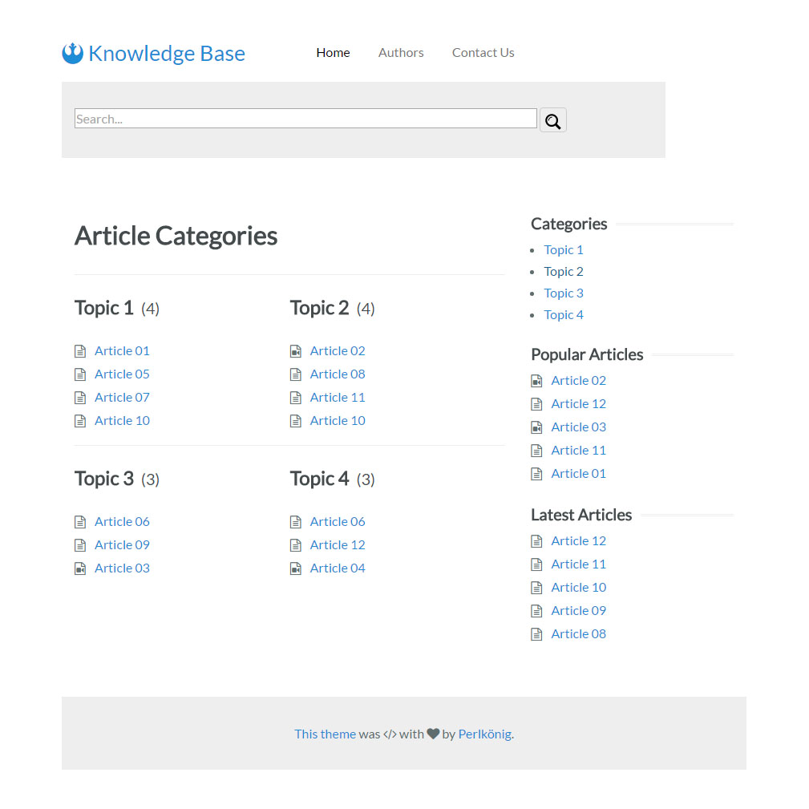

# Knowledge Base Theme



This is a basic theme for a knowledge base for [Grav CMS](http://getgrav.org). It is minimal by design and is easy to customize. It is based on [Yahoo's Pure.css framework](http://purecss.io/).

## Installation

Installing the Knowledge Base theme can be done in one of two ways. The GPM (Grav Package Manager) installation method enables you to quickly and easily install the theme with a simple terminal command, while the manual method enables you to do so via a zip file. 

The theme by itself is useful, but you may have an easier time getting up and running by installing the skeleton. [The Knowledge Base skeleton](https://github.com/Perlkonig/grav-skeleton-knowledge-base) is a complete site with the theme itself, required plugins and configuration, and sample content.

### GPM Installation (Preferred)

The simplest way to install this theme is via the [Grav Package Manager (GPM)](http://learn.getgrav.org/advanced/grav-gpm) through your system's Terminal (also called the command line).  From the root of your Grav install type:

    bin/gpm install knowledge-base

This will install the Knowledge Base theme into your `/user/themes` directory within Grav. Its files can be found under `/your/site/grav/user/themes/knowledge-base`.

### Manual Installation

To install this theme, just download the zip version of this repository and unzip it under `/your/site/grav/user/themes`. Then, rename the folder to `knowledge-base`. You can find these files either on [GitHub](https://github.com/Perlkonig/grav-theme-knowledge-base) or via [GetGrav.org](http://getgrav.org/downloads/themes).

You should now have all the theme files under

    /your/site/grav/user/themes/knowledge-base

**NOTE:** This theme is a modular component for Grav which requires the [CMS itself](http://github.com/getgrav/grav) and the following plugins to properly function as written (you can of course modify the theme once installed):

  * [Error](https://github.com/getgrav/grav-theme-error) 
  * [Problems](https://github.com/getgrav/grav-plugin-problems)
  * [Simple Search](https://github.com/getgrav/grav-plugin-simplesearch)
  * [Count Views](https://github.com/Perlkonig/grav-plugin-count-views) (for the "Popular Articles" sidebar)
  * [Reading Time](https://github.com/getgrav/grav-plugin-readingtime) (for displaying the reading time at the top of each article)
  * [Related Pages](https://github.com/getgrav/grav-plugin-relatedpages) (for the "Related Articles" section at the bottom of each article)

## Updating

As development for the Knowledge Base theme continues, new versions may become available that add additional features and functionality, improve compatibility with newer Grav releases, and generally provide a better user experience. Updating Knowledge Base is easy, and can be done through Grav's GPM system or manually.

### GPM Update (Preferred)

The simplest way to update this theme is via the [Grav Package Manager (GPM)](http://learn.getgrav.org/advanced/grav-gpm). You can do this with this by navigating to the root directory of your Grav install using your system's terminal (also called command line) and typing the following:

    bin/gpm update knowledge-base

This command will check your Grav install to see if your Knowledge Base theme is due for an update. If a newer release is found, you will be asked whether or not you wish to update. To continue, type `y` and hit enter. The theme will automatically update and clear Grav's cache.

### Manual Update

Manually updating Knowledge Base is pretty simple. Here is what you will need to do to get this done:

* Delete the `your/site/user/themes/knowledge-base` directory.
* Download the new version of the Knowledge Base theme from either [GitHub](https://github.com/Perlkonig/grav-plugin-knowledge-base) or [GetGrav.org](http://getgrav.org/downloads/themes).
* Unzip the zip file in `your/site/user/themes` and rename the resulting folder to `knowledge-base`.
* Clear the Grav cache. The simplest way to do this is by going to the root Grav directory in terminal and typing `bin/grav clear-cache`.

> Note: Any changes you have made to any of the files listed under this directory will also be removed and replaced by the new set. Any files located elsewhere (for example a YAML settings file placed in `user/config/themes`) will remain intact.

## Customizing

To modify or customize this theme, you must first do two things:

1. Copy `user/themes/knowledge-base/knowledge-base.yaml` to `/user/config/themes/knowledge-base.yaml`.

2. [Read and follow the documentation on theme inheritance](https://learn.getgrav.org/themes/customization#theme-inheritance). 

Following these instructions is the only way to ensure that your changes are not lost when the theme gets updated.

### Configuration

This theme can be configured in two places: `user/config/themes/knowledge-base.yaml` and `user/config/site.yaml`.

#### `knowledge-base.yaml`

Here is the default configuration, which is commented to explain what the different settings do:

```yaml
params:
  articles:
    root: /home                # the route where the articles themselves live
    blacklist: ['scratch']     # list of categories to ignore
    show:             # if all are set to false, the article header is removed
      date: true      # show article date in the article header
      authors: true   # show article authors in the article header
      topics: true    # show assigned topics in the article header
      time: true      # show reading time in the article header
  front:              # params for the front page content
    maxrows: 3        # the maximum number of rows on the front page
    maxentries: 5     # maximum number of articles displayed for each category
  sidebar:            # params for the sidebar
    maxentries: 5     # maximum number of articles to display in "Popular" and "Latest" sections
    show:               # if all are set to false, the sidebar is removed
      categories: true  # show Category list in the sidebar
      popular: true     # show the Popular Articles sidebar
      latest: true      # show the Latest Articles sidebar
```

**Notes on `params:articles:blacklist`:** Any articles containing a blacklisted category will not appear on the front page, in the sidebar, or in the list of articles by a given author. 

#### `site.yaml`

Your `site.yaml` must specify three taxonomies: 

```yaml
taxonomies: [category,tag,author]
```

The only theme-specific customization looked for here is the text for the footer. You can change the footer text without touching the templates by adding something like the following to `user/config/site.yaml`:

```yaml
footertext: |
	<p>
		First footer line.
	</p>
	<p>
		Here's a second.
	</p>
```

### CSS

The template loads `theme://css/custom.css` if it exists. The simplest way to customize the CSS is to create this file in your inherited theme and add what styles you need. This way the base `css/knowledge-base.css` can be updated without losing your customizations.

### Templates

To override templates, simply copy the file from the base theme into the same place in your inherited theme and edit as desired. If you configured your inheritied theme correctly, the Grav system will first look for files in your inherited theme. If it's not present, it will pull the file from the base theme.

## Content

### Templates

The following templates are available:

  * `author` is used for displaying information about an author and articles they have authored.

  * `default` is a blank template that just dumps a page's content.

  * `error` is used for displaying error messages. 

  * `front` is only used for generating the front page. The front page is organzed by the `category` taxonomy.

  * `item` is used for an article.

  * `taxonomy` is used to display articles by taxonomy (i.e., category, tag, author).

### Structure

Hopefully you're working with [the skeleton packge that contains all the sample content](https://github.com/Perlkonig/grav-skeleton-knowledge-base). If not, at least have a look at that repository so you can follow along.

The theme expects three routes under the `user/pages` folder:

  * `/home` (or whatever was specified in `user/config/themes/knowledge-base.yaml` as `articleroot`)

    This is where all the knowlege base articles live. Each article should have its own folder containing an `item.md` file. There are a few prerequisites for the page front matter:

      * It must contain a `title` field.
      * It must contain an explicit `date` field representing the published date.
      * It must have at least one `category` assigned for it to appear on the front page. `tag` is completely optional. `author` is recommended. Multiple values are supported in any taxonomy.

    Two different icons are currently supported. By default, all articles are marked with a "text" icon. If the article contains media (usually video), then add `media: video` to the front matter. The "video" icon should then be used.

  * `/taxonomy`

    This is where users can get lists of articles by taxonomy. The `taxonomy.md` file can be titled in any way you wish, and it is recommended that caching be disabled. If no query parameters are passed, then it will display a list of known taxonomies. If a taxonomy is passed via the `name` parameter, then it will list valid values for that taxonomy. If the taxonomy value is also passed (via the `val` parameter), then a list of *all* articles matching that specific taxonomy will be listed.

    A note about authors: If a specific author page exists (see `/authors` route below), then the author's name will link to it. If no such page exists, then a generic list of articles will be generated.

  * `/authors`

    This folder should contain a top-level page that contains the following front matter:

    ```yaml
    redirect: taxonomy?name=author
    ```

    All other content and headers will be ignored.

    The folder should then contain folders for each author (optional). The slug is determined by the built-in `hyphenize` twig filter. Each of those folders should contain an `author.md` file. *The page's front matter must include an `author` field containing the properly capitalized and spaced name of the author.* The template will create an initial heading, dump the page content (including images), and then follow with a list of articles this person authored. If no such folder exists, then the `/taxonomy` page will create a simple list of articles written by that author.

The sample content also shows a "Contact Us" page that you will need to configure yourself.

## Credits

This is my first theme. Feedback and pull requests are warmly welcomed.

I decided to try this after a forum post asking if such a template already existed. The poster linked to [a theme called "knowhow" by Hero Themes](http://demo.herothemes.com/#knowhow). That theme inspired this one, but this one was coded completely from scratch with no reference to the original.


